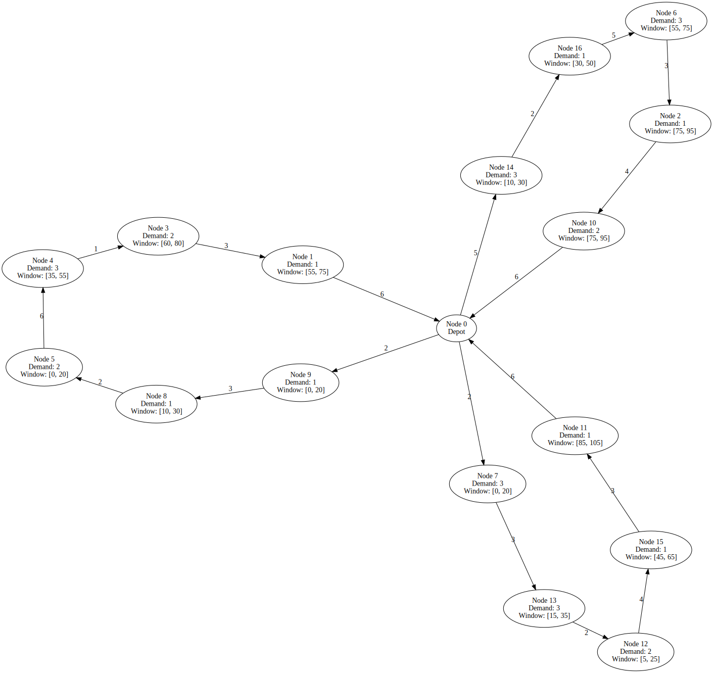

# Capacitated Vehicle Routing Problem with Time Windows (CVRPTW) solver

Capacitated Vehicle Routing Problem with Time Windows (CVRPTW) solver written in Python.

Implementation is based on
["Vehicle Routing Problem with Time Windows" section in Google OR-Tools documentation](https://developers.google.com/optimization/routing/cvrptw).


## What's this?

This program solves Capacitated Vehicle Routing Problem with Time Windows (CVRPTW).

For example, given the following network and three vehicles at the depot (Node 0),
consider the problem of what route each vehicle should take to pick up all the demands
of all the nodes in the shortest possible time.


In this case, this program would give the following solution, for example:




## Prerequisites

Python 3.10 or later is required.


## Usage

First, install the dependencies:

```shell
# Install Graphviz on macOS (On other platforms, use their own package managers)
$ brew install graphviz

# Create a Python virtual environment
$ python -m venv .venv
# Activate the virtualenv
$ source .venv/bin/activate
# Install the dependencies
$ pip install -r requirements.txt
```

Alternatively, if you have Poetry installed, run the following commands instead of the
second to fourth line above:

```shell
$ poetry install
$ poetry shell
```

Then, let's solve an example!

```shell
$ python solver.py data.example.yaml
```

It should output the following solution:

```
Route for vehicle 0:
     [Node  0: Load( 0) Time( 0,   0)]
  -> [Node  9: Load( 0) Time( 2,   5)]
  -> [Node  8: Load( 1) Time(10,  13)]
  -> [Node  5: Load( 2) Time(17,  20)]
  -> [Node  4: Load( 4) Time(35,  55)]
  -> [Node  3: Load( 7) Time(60,  67)]
  -> [Node  1: Load( 9) Time(68,  75)]
  -> [Node  0: Load(10) Time(79, 100)]
Load of the route: 10
Time of the route: 79 min

Route for vehicle 1:
     [Node  0: Load( 0) Time( 0,   8)]
  -> [Node  7: Load( 0) Time( 2,  10)]
  -> [Node 13: Load( 3) Time(15,  18)]
  -> [Node 12: Load( 6) Time(22,  25)]
  -> [Node 15: Load( 8) Time(45,  65)]
  -> [Node 11: Load( 9) Time(85,  89)]
  -> [Node  0: Load(10) Time(96, 100)]
Load of the route: 10
Time of the route: 96 min

Route for vehicle 2:
     [Node  0: Load( 0) Time( 0,  25)]
  -> [Node 14: Load( 0) Time(10,  30)]
  -> [Node 16: Load( 3) Time(30,  50)]
  -> [Node  6: Load( 4) Time(55,  72)]
  -> [Node  2: Load( 7) Time(75,  80)]
  -> [Node 10: Load( 8) Time(84,  89)]
  -> [Node  0: Load(10) Time(95, 100)]
Load of the route: 10
Time of the route: 95 min

Total time of all routes: 270 min
```

In addition, if you want to export images of the network and routes, you can specify
filenames for them using `-n/--export-network-graph` and `-r/--export-route-graph`
options:

```shell
$ python solver.py data.example.yaml \
    --export-network-graph network.png \
    --export-route-graph route.png
```

Then the program saves the network image to `network.png` and the route image to
`route.png` for vizualizing the network and vehicle routes.

File format is automatically determined by the file extension;
see https://graphviz.org/docs/outputs/ for the supported file formats.
For example, if you pass `--export-network-graph network.svg`,
the file will be the SVG format.

`data.example.yaml` is just example data created for a dummy problem,
so if you have your own problem to solve, copy this file, create your own `data.yaml`
and pass it to the program! 💪

```shell
$ python solver.py data.yaml
```
